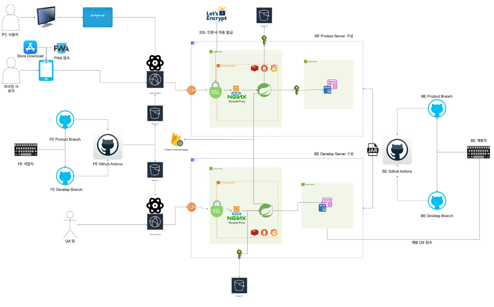

## 🖥️ 프로젝트 소개

- 실사용자 수
- 주요 타겟: 중앙대학교 소프트웨어대학 동문
- 핵심 기능: 
- 서비스 링크: https://causw.co.kr

## 🕰️ 개발 기간
* 언제부터 ~

### ⚙️ 개발 환경
- **Language** : Java
- **Framework** : SpringBoot
- **Database** : Amazon Aurora MySQL
- **ORM** : JPA(Hibernate)
- **Build**: Gradle 

## 🖥️ 서버 환경

## 📌 주요 기능

## 🏗️ 시스템 아키텍처 
- app-main/

 └─ src/main/java/net.causw.app.main
    ├─ controller/        
    ├─ service/           
    ├─ repository/        
    ├─ domain/
    │   ├─ model/         
    │   ├─ policy/        
    │   └─ validation/    
    ├─ dto/               
    ├─ infrastructure/    
    └─ CauswApplication

  -global/

 └─ src/main/java/net.causw.global
    ├─ constant/     
    ├─ exception/    
    └─ util/         

#대표 도메인
- User & Academic

  UserController, UserAcademicRecordApplicationController, UserCouncilFeeController

- Circle & Community

  CircleController, BoardController, PostController, CommentController, ChildCommentController

- Event & Schedule 

  EventController, CalendarController, SemesterController, CeremonyController

- Application & Form

  FormController, InquiryController

- Facility & Resource

  LockerController, StorageController

- Notification

  NotificationLogController, PushController

- Common / Global

  CommonController, GlobalExceptionHandler

## 📂 디렉터리 구조 

## Contact
Email : caucsedongne@gmail.com